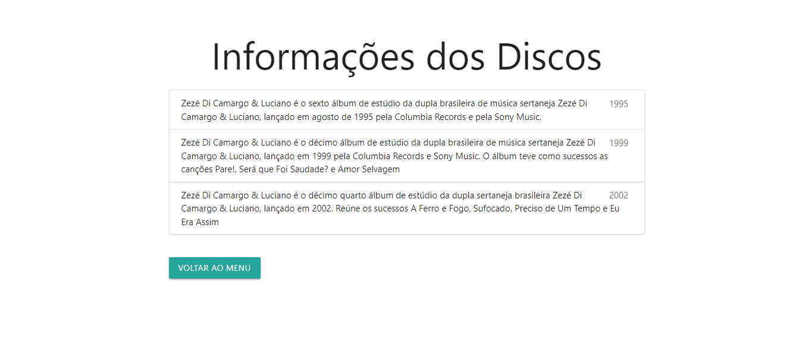
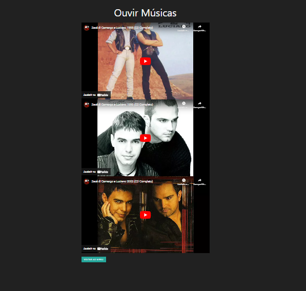
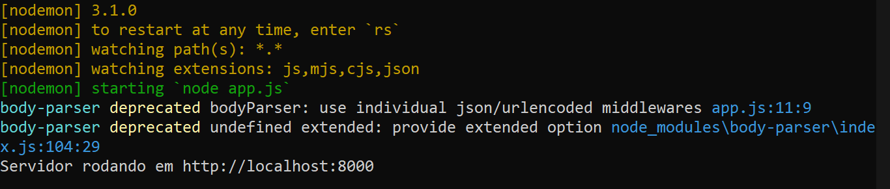

# LOJA DE DISCOS COM EJS
👨‍🏫LOJA DE DISCOS COM EJS, EXPRESSJS E JSON.

 <br> <br> 
 <br> <br>
 <br> <br>
 <br> <br>
 <br> <br>
 <br> 

## DESCRIÇÃO:
O projeto de `loja de discos` é um aplicativo web que permite aos usuários explorar uma seleção de discos disponíveis. Ele fornece informações detalhadas sobre cada disco, como ano de lançamento e descrição do álbum.

1. **Visualização de Discos:** Os usuários podem visualizar uma lista de discos disponíveis.
2. **Detalhes do Disco:** Cada disco exibe informações como ano de lançamento e uma descrição detalhada do álbum.
3. **Navegação:** Os usuários podem navegar entre os diferentes discos usando a interface do aplicativo.
4. **Voltar ao Menu:** Existe um botão "Voltar ao Menu" que permite aos usuários retornar à página inicial do aplicativo.

## EXECUTANDO O PROJETO:
1. **Instalando as Depêndencias:**
   - Para instalar as dependências listadas no arquivo "package.json", você pode usar o comando `npm install` ou simplesmente `npm i` no terminal. Certifique-se de estar no diretório do seu projeto onde o arquivo "package.json" está localizado. O npm irá ler o arquivo "package.json" e instalar todas as dependências listadas nele. 

   - Aqui está o comando:

   ```bash
   npm install
   ```

   ou

   ```bash
   npm i
   ```

2. **Executando o Aplicativo:**
   - Para subir o servidor, no diretório do seu [projeto](./CODIGO/app.js), digite o seguinte comando no Terminal/CMD:
   ```bash
   node app.js
   ```

   - Acesse o APP no navegador visitando [http://localhost:8000](http://localhost:8000).

3. **Usando o APP:**
   1. Ao acessar a página inicial do aplicativo, os usuários serão apresentados a uma lista de discos disponíveis.
   2. Cada item da lista corresponde a um disco específico e exibe o ano de lançamento e uma breve descrição.
   3. Para obter mais informações, o usuário pode clicar em `informações`.
   4. Isso o levará a uma página de detalhes dos discos, onde informações mais detalhadas sobre os álbuns serão exibidas, como ano de lançamento e descrição completa.
   5. Para retornar à página inicial, os usuários podem clicar no botão "Voltar ao Menu" localizado na parte inferior da página de detalhes do disco.

4. **Uso do arquivo `informacoes.json`:**
   - O arquivo `./CODIGO/public/informacoes.json` contém os dados dos discos disponíveis informações.
   - Esses dados são lidos pelo aplicativo e usados para exibir as informações sobre os discos na interface do usuário.
   - Qualquer atualização ou adição de novos discos deve ser feita diretamente no arquivo `informacoes.json` seguindo o formato JSON fornecido. As alterações serão refletidas automaticamente na interface do aplicativo quando ele for reiniciado.

## NÃO SABE?
- Entendemos que para manipular arquivos em `HTML`, `CSS` e outras linguagens relacionadas, é necessário possuir conhecimento nessas áreas. Para auxiliar nesse aprendizado, oferecemos cursos gratuitos disponíveis:
* [CURSO DE EJS](https://github.com/VILHALVA/CURSO-DE-EJS)
* [CURSO DE NODEJS](https://github.com/VILHALVA/CURSO-DE-NODEJS)
* [CURSO DE EXPRESSJS](https://github.com/VILHALVA/CURSO-DE-EXPRESSJS)
* [CURSO DE JSON](https://github.com/VILHALVA/CURSO-DE-JSON)
* [CONFIRA MAIS CURSOS](https://github.com/VILHALVA?tab=repositories&q=+topic:CURSO)

## CREDITOS:
- [PROJETO CRIADO PELO VILHALVA](https://github.com/VILHALVA)


